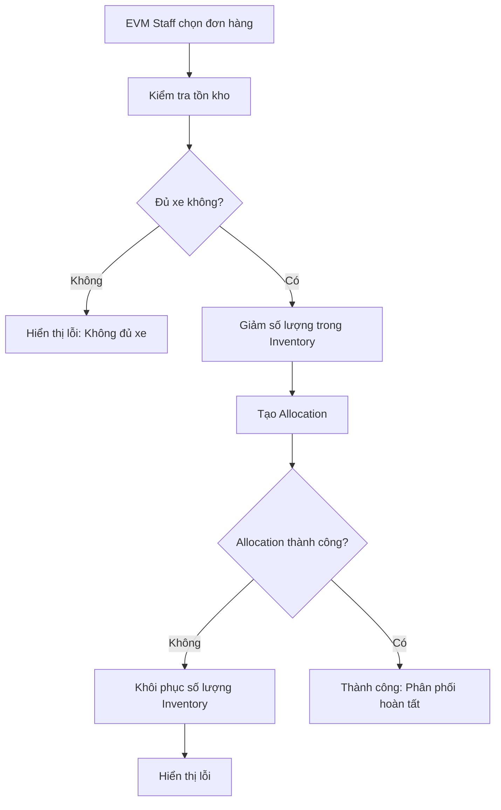
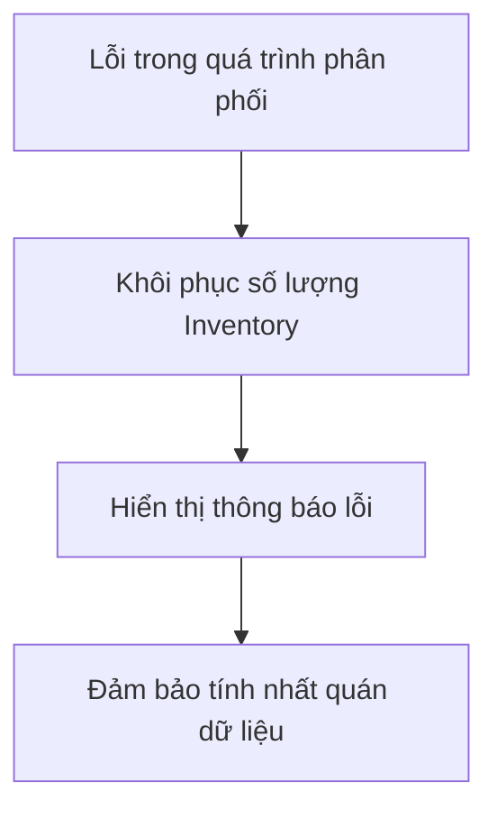

# Inventory & Allocation Flow Documentation

## Tổng quan luồng

Luồng này mô tả cách EVM Staff quản lý tồn kho và phân phối xe cho Dealer, đảm bảo tính nhất quán dữ liệu giữa Inventory và Allocation.

## Luồng chính

### 1. Inventory Management (Quản lý tồn kho)
- **Màn hình**: `InventoryManagementScreen.js`
- **Service**: `inventoryService.js`
- **Chức năng**: 
  - Xem danh sách tồn kho theo tab (Còn hàng/Hết hàng)
  - Thêm/sửa/xóa mục tồn kho
  - Theo dõi trạng thái tồn kho (in_stock, low_stock, out_of_stock)

### 2. Allocation Management (Phân phối xe)
- **Màn hình**: `AllocationManagementScreen.js`
- **Service**: `allocationService.js` + `inventoryService.js`
- **Chức năng**:
  - Xem đơn hàng chờ phân phối
  - Phân phối xe cho Dealer
  - **Tự động giảm số lượng trong Inventory**

## Luồng chi tiết

### Khi EVM Staff phân phối xe:



### Khi có lỗi xảy ra:



## API Endpoints (Backend Integration)

### Inventory Service

```javascript
// Lấy danh sách tồn kho
GET /api/inventory
Response: {
  success: boolean,
  data: InventoryItem[]
}

// Giảm số lượng tồn kho
POST /api/inventory/reduce
Body: {
  vehicleModel: string,
  color: string,
  warehouseLocation: string,
  quantityToReduce: number
}
Response: {
  success: boolean,
  data: InventoryItem,
  error?: string
}

// Khôi phục số lượng tồn kho
POST /api/inventory/restore
Body: {
  vehicleModel: string,
  color: string,
  warehouseLocation: string,
  quantityToRestore: number
}
Response: {
  success: boolean,
  data: InventoryItem,
  error?: string
}
```

### Allocation Service

```javascript
// Tạo phân phối
POST /api/allocations
Body: {
  orderId: string,
  dealerId: string,
  dealerName: string,
  vehicleModel: string,
  quantity: number,
  color: string,
  vehicleVIN: string,
  warehouseLocation: string,
  estimatedDelivery: string,
  notes: string,
  priority: string
}
Response: {
  success: boolean,
  data: Allocation,
  error?: string
}
```

## Data Models

### InventoryItem
```javascript
{
  id: string,
  vehicleModel: string,
  color: string,
  quantity: number,
  warehouseLocation: string,
  price: number,
  description: string,
  lastUpdated: string,
  status: 'in_stock' | 'low_stock' | 'out_of_stock'
}
```

### Allocation
```javascript
{
  id: string,
  orderId: string,
  dealerId: string,
  dealerName: string,
  vehicleModel: string,
  quantity: number,
  color: string,
  vehicleVIN: string,
  warehouseLocation: string,
  estimatedDelivery: string,
  notes: string,
  priority: 'low' | 'normal' | 'high',
  status: 'pending' | 'confirmed' | 'shipped' | 'delivered' | 'cancelled',
  createdAt: string,
  updatedAt: string
}
```

## Business Rules

### 1. Inventory Status Rules
- **in_stock**: quantity > 10
- **low_stock**: 0 < quantity ≤ 10
- **out_of_stock**: quantity = 0

### 2. Allocation Rules
- Chỉ có thể phân phối xe có quantity > 0
- Phải kiểm tra tồn kho trước khi tạo allocation
- Nếu allocation thất bại, phải khôi phục inventory
- Mỗi allocation phải có VIN duy nhất

### 3. Error Handling
- Rollback inventory nếu allocation thất bại
- Hiển thị thông báo lỗi rõ ràng
- Đảm bảo tính nhất quán dữ liệu

## Transaction Flow

### 1. Allocation Transaction
```javascript
try {
  // Step 1: Check and reduce inventory
  const inventoryResponse = await inventoryService.reduceInventoryQuantity(
    vehicleModel, color, warehouseLocation, quantity
  );
  
  if (!inventoryResponse.success) {
    throw new Error(inventoryResponse.error);
  }
  
  // Step 2: Create allocation
  const allocationResponse = await allocationService.createAllocation(allocationData);
  
  if (!allocationResponse.success) {
    // Rollback inventory
    await inventoryService.restoreInventoryQuantity(
      vehicleModel, color, warehouseLocation, quantity
    );
    throw new Error(allocationResponse.error);
  }
  
  return { success: true, data: allocationResponse.data };
} catch (error) {
  // Additional rollback if needed
  return { success: false, error: error.message };
}
```

### 2. Inventory Update Flow
```javascript
// Khi phân phối thành công
Inventory: Model X Black (Warehouse A) - 25 → 20 (giảm 5 xe)

// Khi có lỗi và rollback
Inventory: Model X Black (Warehouse A) - 20 → 25 (khôi phục 5 xe)
```

## UI/UX Features

### 1. Inventory Screen
- **Tab Navigation**: Còn hàng / Hết hàng
- **Real-time Updates**: Tự động refresh khi quay lại màn hình
- **Status Indicators**: Màu sắc phân biệt trạng thái
- **Search & Filter**: Tìm kiếm theo mẫu xe, màu sắc, kho

### 2. Allocation Screen
- **Order Summary**: Hiển thị thông tin đơn hàng
- **Inventory Check**: Kiểm tra tồn kho trước khi phân phối
- **Error Handling**: Thông báo lỗi rõ ràng
- **Success Feedback**: Xác nhận phân phối thành công

## Testing Scenarios

### 1. Happy Path
1. EVM Staff mở Allocation screen
2. Chọn đơn hàng cần phân phối
3. Điền thông tin phân phối
4. Xác nhận phân phối
5. Kiểm tra Inventory giảm đúng số lượng

### 2. Error Scenarios
1. **Không đủ xe**: Hiển thị lỗi, không tạo allocation
2. **Allocation thất bại**: Khôi phục inventory, hiển thị lỗi
3. **Network error**: Rollback inventory, hiển thị lỗi

### 3. Edge Cases
1. **Concurrent allocations**: Xử lý race condition
2. **Large quantities**: Kiểm tra giới hạn
3. **Invalid data**: Validation trước khi xử lý

## Performance Considerations

### 1. Caching
- Cache inventory data để giảm API calls
- Invalidate cache khi có thay đổi

### 2. Optimistic Updates
- Cập nhật UI ngay lập tức
- Rollback nếu có lỗi

### 3. Batch Operations
- Xử lý nhiều allocation cùng lúc
- Giảm số lượng API calls

## Security Considerations

### 1. Authorization
- Chỉ EVM Staff mới có thể phân phối
- Kiểm tra quyền truy cập

### 2. Data Validation
- Validate input data
- Sanitize user input

### 3. Audit Trail
- Log tất cả thay đổi inventory
- Track allocation history

## Monitoring & Alerting

### 1. Inventory Alerts
- Low stock warnings
- Out of stock notifications
- Inventory level monitoring

### 2. Allocation Monitoring
- Failed allocation tracking
- Performance metrics
- Error rate monitoring

## Future Enhancements

### 1. Advanced Features
- **Auto-replenishment**: Tự động đặt hàng khi hết stock
- **Demand forecasting**: Dự đoán nhu cầu
- **Multi-warehouse**: Quản lý nhiều kho

### 2. Integration
- **ERP Integration**: Kết nối với hệ thống ERP
- **Supplier Integration**: Kết nối với nhà cung cấp
- **Analytics**: Báo cáo và phân tích

### 3. Mobile Features
- **Push Notifications**: Thông báo real-time
- **Offline Support**: Hoạt động offline
- **Barcode Scanning**: Quét mã vạch

## Conclusion

Luồng Inventory & Allocation được thiết kế để đảm bảo:
- **Data Consistency**: Tính nhất quán dữ liệu
- **Error Handling**: Xử lý lỗi robust
- **User Experience**: Trải nghiệm người dùng tốt
- **Scalability**: Dễ dàng mở rộng
- **Maintainability**: Dễ bảo trì và phát triển

Luồng này sẵn sàng để tích hợp với Backend và có thể mở rộng theo nhu cầu kinh doanh.
